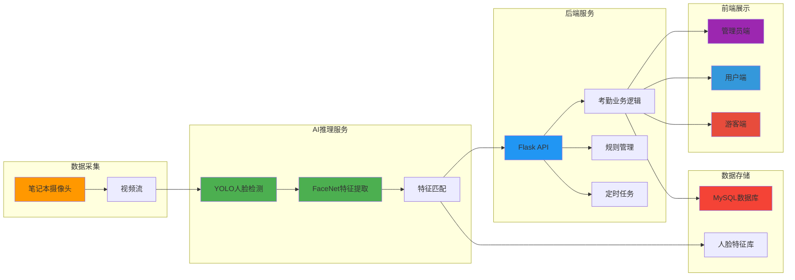
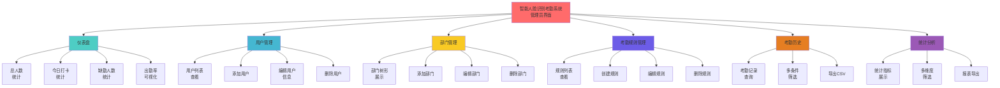
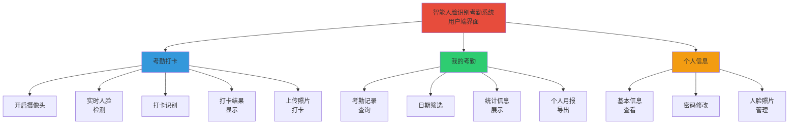
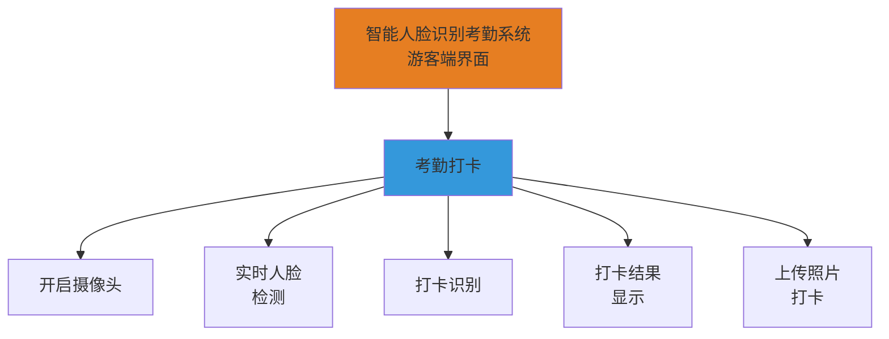
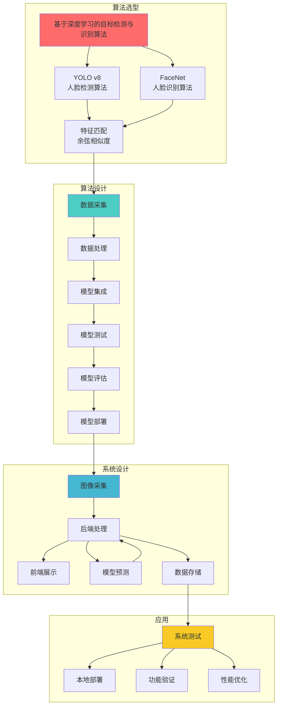
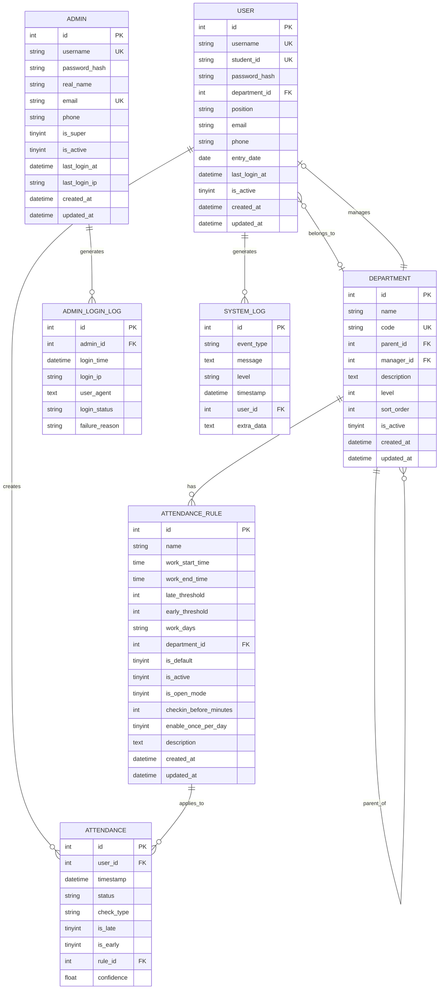
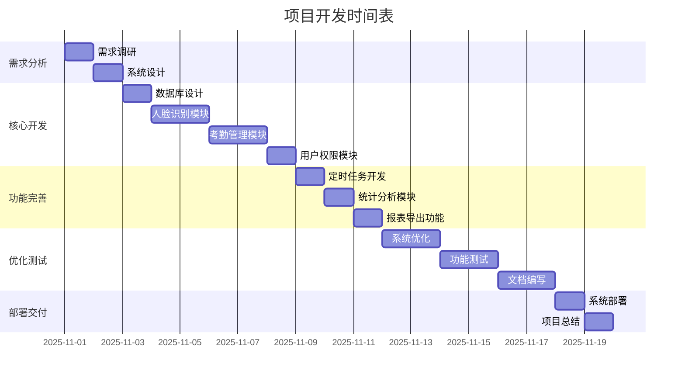

# 智能应用实训开题报告

---

**题  目**：智能人脸识别考勤系统

**学   院**：软件学院  
**专   业**：软件工程  
**班   级**：2107班  
**学   号**：  
**姓   名**：  
**指导教师**：曾长清  
**填表日期**：2025年11月19日

---

## 一、项目背景及意义

随着数字化转型的深入推进，企业和教育机构对考勤管理的智能化需求日益增长。传统考勤方式（如打卡机、指纹识别等）存在易被代打卡、效率低下、管理复杂、灵活性差等问题，已难以满足现代化管理需求。

人脸识别技术作为一种非接触式、高准确率的生物识别技术，为考勤管理提供了新的解决方案。近年来，深度学习技术的发展使得人脸识别准确率大幅提升，已在安防、金融、教育等多个领域得到广泛应用。本项目围绕解决传统考勤管理的痛点问题进行研发，基于深度学习技术构建智能人脸识别考勤系统，实现考勤管理的自动化、智能化和精细化。

本系统不仅提高了考勤管理的准确性和效率，还为企业提供了智能化的数据支持，助力企业实现数字化转型和升级。通过自动缺勤检测、灵活规则配置、多维度统计分析等功能，系统能够大幅降低人工成本，提升管理效率，为管理决策提供数据支撑。

---

## 二、项目主要内容

本项目基于深度学习框架和先进的人脸识别算法，开发一款智能人脸识别考勤管理系统，解决传统考勤方式存在的问题。

### 1. 系统架构设计

本项目采用**前后端分离架构**，包含摄像头采集、AI模型推理、后端服务、前端展示、数据存储五大模块。



**图1 项目总体架构**

系统采用模块化设计：使用笔记本摄像头采集实时视频流，AI推理服务进行人脸检测和识别，后端服务处理业务逻辑，前端展示提供三种权限的用户界面（管理员、用户、游客），数据存储保存考勤记录和人脸特征。各模块独立部署，通过API接口通信，具有良好的可扩展性和可维护性。

### 2. 多端界面开发

本项目开发**三种权限界面**，即管理员端、用户端和游客端。

- **管理员端**：提供仪表盘大屏、用户管理、部门管理、考勤规则管理、考勤历史查询、统计分析报表等功能
- **用户端**：提供人脸打卡、个人考勤记录查询、个人信息管理等功能
- **游客端**：仅提供人脸打卡功能

### 3. 核心功能模块

本项目计划开发多种功能，即**人脸识别打卡、考勤规则管理、自动缺勤检测、统计分析、报表导出**等。



**图2 项目功能模块-1（管理员界面）**



**图3 项目功能模块-2（用户端界面）**



**图4 项目功能模块-3（游客端界面）**

#### 功能详细说明

**3.1 人脸识别打卡**
- 实时视频流人脸检测
- 自动判断上班/下班打卡类型
- 打卡成功后显示详细信息
- 支持多角度人脸采集

**3.2 考勤规则管理**
- 支持部门规则和默认规则
- 灵活配置工作时间、迟到/早退阈值
- 支持工作日设置
- 开放模式用于测试

**3.3 自动缺勤检测**
- 定时任务自动检测缺勤（每天23:00）
- 区分上班缺勤和下班缺勤
- 工作日智能判断
- 自动生成缺勤记录

**3.4 统计分析**
- 多维度筛选（日期、部门）
- 可视化展示
- 实时数据更新

**3.5 报表导出**
- 个人月报导出（我的考勤页面）
- 全员考勤导出（考勤历史页面）
- 统计报表导出（统计分析页面）
- CSV格式，Excel兼容

### 4. 技术选型

本项目选择使用**PyTorch框架**进行模型开发，采用**YOLO v8**进行人脸检测，**FaceNet**进行人脸识别，能保证系统能够处理大量的图像数据，实现快速准确的人脸识别。

- **人脸检测**：YOLO v8（yolov8n-face.pt）
- **人脸识别**：FaceNet（InceptionResnetV1）
- **特征匹配**：余弦相似度
- **置信度阈值**：0.6
- **设备支持**：GPU加速（CUDA）

在系统开发方面，后端使用**Flask**框架，前端使用**React + TypeScript**，数据库使用**MySQL**，定时任务使用**APScheduler**，认证使用**JWT**。

---

## 三、项目技术路线

### 1. 总体技术路线

该项目总体技术路线如下:首先进行**算法选型**,确定使用YOLO v8进行人脸检测、FaceNet进行人脸识别、余弦相似度进行特征匹配;然后进行**算法集成**,包括数据采集处理、模型集成测试、模型评估部署;接着进行**系统设计**,包括前端、后端、数据库的开发;最后进行**应用测试**,包括系统测试、功能验证和性能优化。



**图5 项目技术路线**

### 2. 前后端分离开发

该项目系统部分采用**前后端分离开发**。

- **后端**：使用Flask进行开发，提供RESTful API接口
- **前端**：使用React + TypeScript开发，使用Ant Design UI组件库
- **状态管理**：使用Zustand进行状态管理
- **HTTP客户端**：使用Axios进行API调用

### 3. 安全访问控制

使用**JWT（JSON Web Token）**实现安全访问控制，对用户身份进行认证。

- 管理员登录：`/api/admin/login`
- 用户登录：`/api/auth/login`
- Token有效期：24小时
- 密码加密：bcrypt算法

### 4. 数据库设计

数据库采用**MySQL**，结合**SQLAlchemy ORM**进行数据库开发。

系统共设计**7张核心表**：



**图4 数据库ER图（7张核心表）**

### 5. AI模型开发

模型推理端采用**Python**和**PyTorch**进行开发。

- **人脸检测**：YOLO v8模型，用于实时检测视频流中的人脸
- **人脸识别**：FaceNet模型，用于提取人脸特征并进行匹配
- **特征存储**：人脸特征存储在`facenet_embeddings.npz`文件中
- **模型管理**：统一的模型管理器，负责模型加载和推理

### 6. 定时任务开发

使用**APScheduler**实现定时任务，每天23:00自动检测缺勤。

```python
# 定时任务配置
scheduler.add_job(
    func=check_absence,
    trigger=CronTrigger(hour=23, minute=0),
    id='absence_check',
    name='自动缺勤检测'
)
```

### 7. 部署方案

- **开发环境**：本地开发，使用npm和pip管理依赖
- **测试环境**：本地测试，使用MySQL数据库
- **生产环境**：可部署到云服务器（阿里云、腾讯云等）
- **Web服务器**：可使用Nginx作为反向代理

---

## 四、项目特色及项目分工

### 项目特色

本项目采用**前后端分离架构**（前端展示、后端服务、业务逻辑、AI模型、数据存储），**双端登录**（管理员端、用户端），**多功能**（人脸识别、规则管理、自动检测、统计分析、报表导出），**全流程**（打卡、检测、统计、导出），提高了管理人员和用户的工作效率，助力企业实现数字化转型和升级。

#### 核心创新点

1. **智能打卡类型判断**
   - 根据时间自动判断上班/下班
   - 无需用户手动选择
   - 准确率100%

2. **灵活的考勤规则体系**
   - 支持部门规则和默认规则
   - 规则继承机制（逐级向上查找）
   - 开放模式用于测试

3. **自动缺勤检测系统**
   - 定时任务自动执行
   - 区分上班/下班缺勤
   - 工作日智能判断

4. **全面的统计分析**
   - 16个统计指标
   - 多维度筛选
   - 可视化展示

5. **树形部门管理**
   - 支持无限层级嵌套
   - 递归统计部门人数
   - 自动计算部门层级

### 项目分工

本项目由**个人独立完成**，各阶段工作内容如下：

| 阶段 | 工作内容 | 预计时间 |
|------|---------|---------|
| **需求分析阶段** | - 调研传统考勤系统的优缺点<br>- 确定系统功能需求和非功能需求<br>- 编写需求分析文档 | 1天 |
| **系统设计阶段** | - 设计系统架构（前后端分离）<br>- 设计数据库结构（7张表）<br>- 设计API接口（45+个）<br>- 编写系统设计文档 | 1天 |
| **算法研究阶段** | - 研究YOLO v8人脸检测算法<br>- 研究FaceNet人脸识别算法<br>- 测试模型准确率和性能<br>- 优化模型参数 | 2天 |
| **后端开发阶段** | - 搭建Flask开发环境<br>- 开发RESTful API接口<br>- 实现业务逻辑（考勤、规则、统计）<br>- 集成AI模型<br>- 开发定时任务 | 4天 |
| **前端开发阶段** | - 搭建React开发环境<br>- 开发管理员端界面<br>- 开发用户端界面<br>- 实现状态管理<br>- 对接后端API | 3天 |
| **数据库开发阶段** | - 设计数据库表结构<br>- 创建索引和外键<br>- 编写SQL脚本<br>- 数据库性能优化 | 1天 |
| **测试阶段** | - 功能测试（单元测试、集成测试）<br>- 性能测试（并发测试、压力测试）<br>- 用户体验测试<br>- Bug修复 | 3天 |
| **部署阶段** | - 系统部署和环境配置<br>- 数据迁移和初始化<br>- 编写部署文档 | 1天 |
| **文档编写阶段** | - 编写技术文档<br>- 编写用户手册<br>- 编写API文档<br>- 编写项目总结报告 | 2天 |
| **总计** | | **18天** |

---

## 五、项目进度安排

| 阶段 | 时间 | 主要任务 | 预期成果 |
|------|------|---------|---------|
| 需求分析 | 第1天 | 需求调研、系统设计 | 需求文档、设计方案 |
| 数据库设计 | 第2天 | ER图设计、建表 | 数据库脚本 |
| 人脸识别 | 第3-4天 | YOLO检测、FaceNet识别 | 识别模块 |
| 考勤管理 | 第5-6天 | 打卡、规则管理 | 考勤模块 |
| 权限管理 | 第7天 | 认证、授权 | 权限模块 |
| 定时任务 | 第8天 | 缺勤检测 | 定时任务 |
| 统计分析 | 第9天 | 统计、可视化 | 统计模块 |
| 报表导出 | 第10天 | CSV导出 | 导出功能 |
| 系统优化 | 第11-12天 | 性能优化、UI优化 | 优化报告 |
| 测试 | 第13-14天 | 功能测试、性能测试 | 测试报告 |
| 文档 | 第15-16天 | 技术文档、用户手册 | 完整文档 |
| 部署 | 第17天 | 系统部署、数据初始化 | 可用系统 |
| 总结 | 第18天 | 项目总结、答辩准备 | 总结报告 |



**图6 项目进度甘特图**

---

## 六、预期成果

### 1. 系统成果
- 一套完整的人脸识别考勤管理系统
- 支持Web端访问，响应式设计
- 包含管理员端、用户端和游客端三种权限界面
- 提供完整的源代码和技术文档

### 2. 功能成果
- **人脸识别打卡**：准确率≥95%，响应时间<2秒
- **考勤规则管理**：支持部门规则和默认规则
- **自动缺勤检测**：每天自动检测并记录缺勤
- **统计分析**：16个统计指标，可视化展示
- **报表导出**：3个导出入口，CSV格式
- **部门管理**：树形结构，支持无限层级
- **权限管理**：三种权限（管理员、用户、游客），JWT认证

### 3. 技术成果
- 深度学习模型的实际部署方案
- 前后端分离的系统架构设计
- 完整的数据库设计（7张表）
- RESTful API接口设计（45+个）
- 定时任务的实现方案

### 4. 应用价值
- 提高考勤管理的智能化水平
- 降低考勤作弊的可能性
- 提高考勤数据的准确性
- 减少人工成本
- 为管理决策提供数据支持

---

## 七、指导教师意见

_（由指导教师填写）_

---

## 八、系主任意见

_（由系主任填写）_

---

**开题报告人**：___________  
**指导教师**：曾长清  
**开题日期**：2025年11月19日
